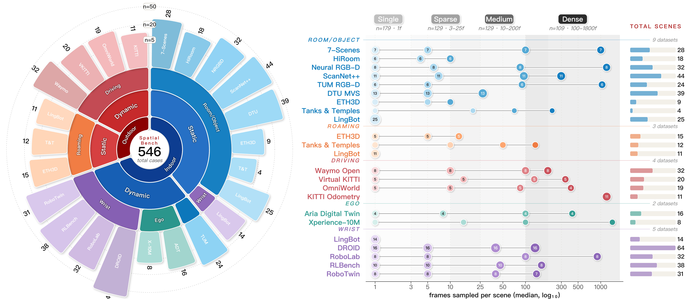

<div align="center">


<h1>SpatialBench: Is Your Spatial Foundation Model an All-Round Player?</h1>


<a href="#citation"></a>
<a href="https://arxiv.org/"></a>
<a href="https://ropedia.github.io/spatialbench"></a>
<a href="https://huggingface.co/datasets/ropedia-ai/SpatialBenchmark"></a>
<a href="https://huggingface.co/datasets/ropedia-ai/DA-Next-5M"></a>
<a href="https://huggingface.co/ropedia-ai/DA-Next"></a>

---

</div>

<div align="center">
  
</div>

## 🔍 Overview

**SpatialBench** is a deterministic, density-aware benchmark for evaluating spatial foundation models across multiple paradigms and various domains. It spans **19 source datasets**, **540+ scenes**, **40+ model variants**, and **six reconstruction paradigms** covering depth, camera pose, trajectory, point-cloud reconstruction, long-sequence streaming, and prior-enhanced tasks.

Every scene is normalized into RGB / metric depth / camera-to-world pose / intrinsics, and the test frames for each scene are precomputed and pinned, so all users evaluate on exactly the same frames. A unified YAML-config + model-adapter interface lets you drop in a new model with a single `predict()` method.

<div align="center">
  
</div>

The leaderboard is reported in [leaderboard.md](leaderboard.md).

## 🔧 Installation

### Setup Environment

```bash
conda create -n spatialbench python=3.11
conda activate spatialbench

# 1) PyTorch — pick the CUDA build that matches your driver (must be installed first)
pip install torch==2.7.0 torchvision==0.22.0 torchaudio==2.7.0 --index-url https://download.pytorch.org/whl/cu128

# 2) Core benchmark harness (no per-model deps yet)
pip install -e .
```

<details>
<summary><b>Per-model extras</b> — click to expand</summary>

Model-specific dependencies are managed via `pip` extras. Install only the ones
you need — every extra below pulls in exactly what is required to run the
corresponding config under `benchmark/configs/`:

```bash
# VGGT and most VGGT-family adapters — vggt, vggt_omega, fastvggt, omnivggt, pi3, pi3x,
# worldmirror, stream3r_{stream,window}, page4d, vggt_long, pi_long, loger, loger_star
pip install -e ".[vggt]"

# Optimization-based DUSt3R / MASt3R adapters (depends on [vggt] + roma + scikit-learn)
pip install -e ".[optimization]"

# MAPAnything (depends on [vggt] + hydra-core + uniception)
pip install -e ".[mapanything]"

# LingbotMap window/stream adapters (depends on [vggt] + flashinfer-python)
pip install -e ".[lingbot-map]"

# Depth Anything 3 family — da3_{small,base,large,giant}, da3nested, da3_streaming
pip install -e ".[da3]"

# Scal3R TTT adapter (depends on [vggt] + numba + pykitti + pypose + rich)
pip install -e ".[scal3r]"

# ZipMap TTT adapter (depends on [vggt]; source is vendored under benchmark/models/zipmap)
pip install -e ".[zipmap]"

# VGG-TTT adapter (depends on [vggt] + hydra-core; source is vendored under benchmark/models/vgg_ttt)
pip install -e ".[vgg_ttt]"

# StreamVGGT / InfiniteVGGT (depends on [vggt] + transformers)
pip install -e ".[streaming]"

# AMB3R benchmark adapter for the README environment above:
# Python 3.11 + torch==2.7.0+cu128 / torchvision==0.22.0+cu128.
# Install the CUDA extension wheels first, then install the Python extra.
pip install torch-scatter==2.1.2 -f https://data.pyg.org/whl/torch-2.7.0+cu128.html
pip install xformers==0.0.30 --index-url https://download.pytorch.org/whl/cu128
pip install spconv-cu126==2.3.8
pip install "git+https://github.com/facebookresearch/pytorch3d.git@V0.7.8" --no-build-isolation
pip install flash-attn==2.7.3 --no-build-isolation
pip install -e ".[amb3r]"

# Combine multiple at once, for example
pip install -e ".[vggt,optimization,mapanything,lingbot-map,da3,scal3r,zipmap,vgg_ttt]"

# Install all currently supported model deps
pip install -e ".[all]"
```

LingbotMap defaults to FlashInfer attention (`use_sdpa: false`). If your package
index cannot resolve a compatible `flashinfer-python` wheel, install FlashInfer
from the wheel index matching your CUDA/PyTorch build, or set `use_sdpa: true`
in the LingbotMap config to use PyTorch SDPA instead.

DUSt3R / MASt3R vendor CroCo under `benchmark/models/{dust3r_root,mast3r_root}/`.
CroCo's CUDA RoPE extension is optional; if it is not compiled, the adapters
fall back to the slower PyTorch RoPE implementation.

### Optional: DA-Next submodule

The DA-Next variant lives in a separate git submodule. If you only run the
benchmark, you can skip this:

```bash
git submodule update --init --recursive DA-Next
```

</details>


### Download Datasets

The benchmark is released on Hugging Face as tar archives — one per sampling
regime, plus an optional ground-truth point-cloud archive. Pick the regime(s)
you need; you do not have to download all archives.

| Archive        | File             | Size     | Recommend |
|----------------|------------------|----------|---------- |
| Single         | `single.tar`     | 1.0 GiB  |           |
| Sparse         | `sparse.tar`     | 5.1 GiB  |   ✅      |
| Medium         | `medium.tar`     | 19.4 GiB |   ✅      |
| Dense          | `dense.tar`      | 73.9 GiB |           |
| Point-cloud GT | `pointcloud.tar` | 1.8 GiB  |   ✅       |

The `pointcloud.tar` archive is required only if you enable point-cloud
evaluation metrics. It unpacks into `SpatialBenchmark/pointcloud/`.

```bash
# Download the archive(s) you need (here: all four single/sparse/medium/dense)
mkdir -p SpatialBenchmark && cd SpatialBenchmark
for split in single sparse medium dense; do
  hf download ropedia-ai/SpatialBenchmark "${split}.tar" \
    --repo-type dataset --local-dir .
done

# Optional: download GT point clouds only when running point-cloud evaluation
hf download ropedia-ai/SpatialBenchmark pointcloud.tar \
  --repo-type dataset --local-dir .

# Extract — each tar unpacks into its own top-level directory (single/, sparse/, ...)
for split in single sparse medium dense; do
  tar -xf "${split}.tar" && rm "${split}.tar"   # drop the rm if you want to keep the archive
done

# Optional: extract GT point clouds for point-cloud evaluation
tar -xf pointcloud.tar && rm pointcloud.tar
```

<details>
<summary>After downloading, the directory tree should look like this (click to expand)</summary>

```bash
SpatialBenchmark
├── _split_log.jsonl
├── dense
│   ├── 7scenes
│   ├── adt
│   ├── droid
│   ├── kitti_odometry
│   ├── nrgbd
│   ├── omniworld
│   ├── rlbench
│   ├── robolab
│   ├── robotwin
│   ├── ropedia
│   ├── scannetpp
│   ├── tanks_and_temples
│   ├── tum
│   ├── vkitti
│   └── waymo
├── medium
│   ├── 7scenes
│   ├── adt
│   ├── droid
│   ├── dtu
│   ├── eth3d
│   ├── hiroom
│   ├── nrgbd
│   ├── omniworld
│   ├── rlbench
│   ├── robolab
│   ├── robotwin
│   ├── ropedia
│   ├── scannetpp
│   ├── tanks_and_temples
│   ├── tum
│   ├── vkitti
│   └── waymo
├── pointcloud              # optional, required only for point-cloud evaluation
│   ├── 7scenes
│   ├── dtu
│   ├── hiroom
│   ├── nrgbd
│   └── scannetpp
├── single
│   ├── 7scenes
│   ├── adt
│   ├── droid
│   ├── dtu
│   ├── eth3d
│   ├── hiroom
│   ├── lingbot
│   ├── nrgbd
│   ├── omniworld
│   ├── rlbench
│   ├── robolab
│   ├── robotwin
│   ├── ropedia
│   ├── scannetpp
│   ├── tanks_and_temples
│   ├── tum
│   ├── vkitti
│   └── waymo
└── sparse
    ├── 7scenes
    ├── adt
    ├── droid
    ├── dtu
    ├── eth3d
    ├── hiroom
    ├── nrgbd
    ├── omniworld
    ├── rlbench
    ├── robolab
    ├── robotwin
    ├── ropedia
    ├── scannetpp
    ├── tanks_and_temples
    ├── tum
    ├── vkitti
    └── waymo
```

</details>

### Download Model Checkpoints

Most adapters auto-download from the Hugging Face Hub the first time they run (e.g. `facebook/VGGT-1B`, `depth-anything/DA3-GIANT-1.1`, `nvidia/vgg-ttt`). If you prefer to pre-stage them, set `checkpoint` in each model yaml to your cache directory before running an evaluation.

### Visualize Benchmark Scenes

Use the web viewer to inspect GT RGB, depth, camera poses, point clouds, and
exported GLB files. The viewer uses the same `benchmark/datasets` readers as
the evaluation harness, so it expects the current SpatialBenchmark layout:

```text
SpatialBenchmark/{single,sparse,medium,dense}/{dataset}/{scene_path}/...
```

Start the viewer from the repository root:

```bash
python visualize_benchmark_web.py \
  --benchmark-root SpatialBenchmark \
  --scene-index benchmark/scene_indices/all_scenes.json \
  --port 8082
```

Then open `http://localhost:8082`. If your dataset is stored elsewhere, point
`--benchmark-root` to that directory. `--scene-index` defaults to
`benchmark/scene_indices/all_scenes.json`, so it only needs to be set when using
a custom scene index.

## 🚀 Quick Start

Run the VGGT baseline on the full benchmark in a single command:

```bash
python benchmark/evaluation/run_benchmark.py \
    --config benchmark/configs/end2end/vggt_eval.yaml
```

Override config fields from the CLI for quick experiments:

```bash
python benchmark/evaluation/run_benchmark.py \
    --config benchmark/configs/end2end/vggt_eval.yaml \
    --tags "droid+sparse" --max-scenes 5 --visualize
```

For the complete usage, tag-filter syntax, model list, and per-metric details, see [benchmark/README.md](benchmark/README.md).

### Tag Filter Syntax

| Syntax | Meaning | Example |
|--------|---------|---------|
| `dataset` | All scenes from a single dataset | `droid`, `dtu`, `tanks_and_temples` |
| `tag1+tag2` | AND: matches both | `dtu+dense`, `droid+sparse+indoor` |
| <code>tag1&#124;tag2</code> | OR: matches either | <code>sparse&#124;dense</code> |
| `null` | No filter, all scenes | |

Available tag axes (values verified against `benchmark/scene_indices/all_scenes.json`):

| Tag axis | Possible values |
|----------|-----------------|
| `source_dataset` | `7scenes`, `adt`, `droid`, `dtu`, `eth3d`, `hiroom`, `kitti_odometry`, `lingbot`, `nrgbd`, `omniworld`, `rlbench`, `robolab`, `robotwin`, `ropedia`, `scannetpp`, `tanks_and_temples`, `tum`, `vkitti`, `waymo` |
| `view_density` | `sparse` / `medium` / `dense` / `single` (1 frame) |
| `environment` | `indoor` / `outdoor` |
| `dynamics` | `static` / `dynamic` |
| `view_type` | `wrist` / `egoview` / `normal` |
| `data_type` | `real` / `simulation` |

> Scenes tagged `single` contain only one frame, so pose / trajectory / point-cloud metrics are undefined — the evaluation harness auto-restricts `eval_metrics` to `["depth"]` when the tag expression includes `single`.

## 📊 Dataset Coverage

SpatialBench unifies 19 source datasets that span indoor / outdoor, real / simulation, static / dynamic, and a range of embodied view types.

| Dataset | Environment | Type | Notes |
|---------|-------------|------|-------|
| DROID | indoor | real / dynamic | Robot manipulation (wrist view) |
| DTU | indoor | real / static | Multi-view stereo (normal view) |
| ETH3D | indoor / outdoor | real / static | High-precision MVS (COLMAP format) |
| 7-Scenes | indoor | real / static | Indoor localization |
| RLBench | indoor | synthetic | Robot simulation tasks |
| Ropedia | indoor | real / dynamic | Robot egocentric view |
| NRGBD | indoor | real / static | Neural RGB-D |
| RoboTwin | indoor | synthetic | Bimanual robot simulation |
| Tanks & Temples | outdoor | real / static | Outdoor large scenes (RobustMVD) |
| TUM | indoor | real / dynamic | RGB-D SLAM |
| ADT | indoor | real / dynamic | Aria Digital Twin |
| OmniWorld | outdoor | simulation / dynamic | Game-engine virtual outdoor scenes |
| Lingbot | indoor / outdoor | real / dynamic | Lingbot robot single-frame scenes |
| VKITTI | outdoor | simulation / dynamic | Virtual KITTI 2 driving simulation |
| Waymo | outdoor | real / dynamic | Waymo Open Dataset autonomous driving (LiDAR depth) |
| RoboLab | indoor | simulation / dynamic | Isaac Sim synthetic (wrist view) |
| HiRoom | indoor | simulation / static | Synthetic indoor (aliasing_mask filtered) |
| ScanNet++ | indoor | real / static | iPhone subset (COLMAP + rendered depth) |


Full per-dataset reader specs live in [benchmark/datasets/data_readers.py](benchmark/datasets/data_readers.py).


## 📖 Models

SpatialBench ships adapters for 40+ spatial foundation model variants. Each lives under `benchmark/evaluation/model_adapters/`. Following the taxonomy used in our main leaderboard, models are grouped into six categories:

- **Optimization-based**: DUSt3R, MASt3R
- **End-to-End Feed-Forward**: VGGT, VGGT-Omega, Fast3R, FastVGGT, MUSt3R, MAPAnything, OmniVGGT, π³, π³-X, AMB3R, DA3 (Small / Base / Large / Giant), DA3-Nested, WorldMirror
- **Online**: Spann3R, CUT3R, MonST3R, Point3R, Stream3R (Stream / Window), StreamVGGT, PAGE4D, InfiniteVGGT, WinT3R, LongStream (Batch / Streaming), LingbotMap (Stream / Window)
- **Chunk-wise**: VGGT-Long, π³-Long, DA3-Streaming
- **SLAM-based**: MASt3R-SLAM, VGGT-SLAM
- **Test-Time Training**: TTT3R, Scal3R, LoGeR, LoGeR*, ZipMap, VGG-TTT

See [benchmark/README.md](benchmark/README.md#currently-supported-models) for the full table and per-model configs under [benchmark/configs/](benchmark/configs/).

### 🌟 DA-Next (Ours)

DA-Next is our metric-scale extension of [Depth Anything 3](https://github.com/ByteDance-Seed/Depth-Anything-3) — it adds a scale head, a camera encoder, and ray-based pose decoding. Source and training/inference instructions live in the [`DA-Next/`](DA-Next/README.md) submodule.

```bash
# Fetch the DA-Next submodule (one-time)
git submodule update --init --recursive DA-Next

# Evaluate DA-Next via the unified harness
python benchmark/evaluation/run_benchmark.py \
    --config benchmark/configs/end2end/danext_eval.yaml
```

### Integrating a New Model

```python
from benchmark.evaluation.model_adapters import register_adapter
from benchmark.evaluation.model_adapters.base_adapter import ModelAdapter

@register_adapter("your_model")
class YourModelAdapter(ModelAdapter):
    def name(self):
        return "YourModel"

    def load_model(self, checkpoint=None, device="cuda"):
        ...

    def predict(self, scene):
        # scene contains images / intrinsic / depth(GT) / extrinsic(GT)
        # Return any subset of pred_depth / pred_pose / pred_pointcloud / pred_confidence
        return {"pred_depth": ..., "pred_pose": ...}

    def supports_metric_depth(self):
        return False
```

Full adapter contract: [benchmark/README.md#integrating-a-new-model](benchmark/README.md#integrating-a-new-model).


## 📈 Evaluation Metrics

| Category | Metrics |
|----------|---------|
| Depth | `abs_rel`, `sq_rel`, `rmse`, `log_rmse`, `delta_1.03`, `delta_1.05`, `delta_1.10` |
| Camera pose (pairwise) | `racc_3` / `racc_5`, `tacc_3` / `tacc_5`, `auc_3 / 5 / 15 / 30` |
| Trajectory (Sim(3) aligned) | ATE, RPE |
| Point cloud | `chamfer_distance`, `f_score` (τ=0.05) |

Predicted poses are aligned to GT via **Procrustes**, and depth metrics are reported with and without scale alignment (median / lstsq) depending on whether the model is metric. See [benchmark/README.md#metric-definitions](benchmark/README.md#metric-definitions) for definitions.

## 📝 To-Do List

- ✅ Release technical report on arXiv
- ✅ Release benchmark dataset on Hugging Face
- ✅ Release DA-Next training scripts
- [ ] Release DA-Next Checkpoint
- [ ] Release DA-Next-5M dataset
- [ ] Update more model adapter

## 🤝 Citation

If SpatialBench is useful for your research, please cite:

```bibtex
@article{peng2026spatialbench,
  title   = {SpatialBench: Is Your Spatial Foundation Model an All-Round Player?},
  author  = {Peng, Haosong and Li, Hao and Chen, Jiaqi and Pan, Yuhao and Yao, Runmao and Dai, Yalun and Huo, Fushuo and Hong, Fangzhou and Chen, Zhaoxi and Wang, Haozhao and Zhang, Dingwen and Liu, Ziwei and Xu, Wenchao},
  journal = {arXiv preprint},
  year    = {2026}
}
```

## 📄 License

- **Benchmark code** (this repository): released under the [CC-BY 4.0](https://creativecommons.org/licenses/by/4.0/).
- **Dataset assets** (released via Hugging Face `ropedia-ai/DA-Next-5M`): released under the [CC-BY-NC 4.0](https://creativecommons.org/licenses/by-nc/4.0/).

Third-party model checkpoints and source datasets remain subject to their original upstream licenses.

## 🙏 Acknowledgments

SpatialBench builds on a large body of prior work. We thank the authors of the following projects whose code or data are reused in this benchmark, as well as the maintainers of the 19 source datasets listed above.

<details>
<summary><b>Optimization-based </b> — click to expand</summary>

- [DUSt3R](https://github.com/naver/dust3r)
- [MASt3R](https://github.com/naver/mast3r)

</details>

<details>
<summary><b>End-to-End Feed-Forward </b> — click to expand</summary>

- [VGGT](https://github.com/facebookresearch/vggt)
- [VGGT-Omega](https://github.com/facebookresearch/vggt-omega)
- [Fast3R](https://github.com/facebookresearch/fast3r)
- [FastVGGT](https://github.com/mystorm16/FastVGGT)
- [MUSt3R](https://github.com/naver/must3r)
- [MAPAnything](https://github.com/facebookresearch/map-anything)
- [OmniVGGT](https://github.com/Livioni/OmniVGGT-official)
- [π³ (Pi3)](https://github.com/yyfz/Pi3)
- [AMB3R](https://github.com/HengyiWang/amb3r)
- [DA3-Small](https://github.com/ByteDance-Seed/Depth-Anything-3)
- [DA3-Base](https://github.com/ByteDance-Seed/Depth-Anything-3)
- [DA3-Large](https://github.com/ByteDance-Seed/Depth-Anything-3)
- [DA3-Giant](https://github.com/ByteDance-Seed/Depth-Anything-3)
- [DA3-Nested](https://github.com/ByteDance-Seed/Depth-Anything-3)
- [WorldMirror (HunyuanWorld-Mirror)](https://github.com/Tencent-Hunyuan/HunyuanWorld-Mirror)

</details>

<details>
<summary><b>Online</b> — click to expand</summary>

- [Spann3R](https://github.com/HengyiWang/spann3r)
- [CUT3R](https://github.com/CUT3R/CUT3R)
- [MonST3R](https://github.com/Junyi42/monst3r)
- [Point3R](https://github.com/YkiWu/Point3R)
- [Stream3R](https://github.com/NIRVANALAN/STream3R)
- [StreamVGGT](https://github.com/wzzheng/StreamVGGT)
- [PAGE4D](https://github.com/Harvard-AI-and-Robotics-Lab/PAGE4D)
- [InfiniteVGGT](https://github.com/AutoLab-SAI-SJTU/InfiniteVGGT)
- [WinT3R](https://github.com/LiZizun/WinT3R)
- [LongStream](https://github.com/3DAgentWorld/LongStream)
- [LingbotMap](https://github.com/Robbyant/lingbot-map)

</details>

<details>
<summary><b>Chunk-wise </b> — click to expand</summary>

- [VGGT-Long](https://github.com/DengKaiCQ/VGGT-Long)
- [π³-Long (Pi-Long)](https://github.com/DengKaiCQ/Pi-Long)
- [DA3-Streaming](https://github.com/ByteDance-Seed/Depth-Anything-3/blob/main/da3_streaming/README.md)

</details>

<details>
<summary><b>SLAM-based </b> — click to expand</summary>

- [MASt3R-SLAM](https://github.com/rmurai0610/MASt3R-SLAM)
- [VGGT-SLAM](https://github.com/MIT-SPARK/VGGT-SLAM)

</details>

<details>
<summary><b>Test-Time Training</b> — click to expand</summary>

- [TTT3R](https://github.com/Inception3D/TTT3R)
- [Scal3R](https://github.com/zju3dv/Scal3R)
- [LoGeR](https://github.com/Junyi42/LoGeR)
- [ZipMap](https://github.com/Haian-Jin/ZipMap)
- [VGG-TTT](https://github.com/nv-dvl/vgg-ttt)

</details>

<details>
<summary><b>Prior-enhanced variants</b> — click to expand</summary>

Configurations that condition the same backbone on additional priors (intrinsics / depth / etc.).

- [DA3-Giant w/ Prior](https://github.com/ByteDance-Seed/Depth-Anything-3)
- [DANext w/ Prior](https://github.com/ByteDance-Seed/Depth-Anything-3)
- [MAPAnything w/ Prior](https://github.com/facebookresearch/map-anything)
- [OmniVGGT w/ Prior](https://github.com/Livioni/OmniVGGT-official)
- [π³-X w/ Prior](https://github.com/yyfz/Pi3)
- [WorldMirror w/ Prior](https://github.com/Tencent-Hunyuan/HunyuanWorld-Mirror)

</details>
